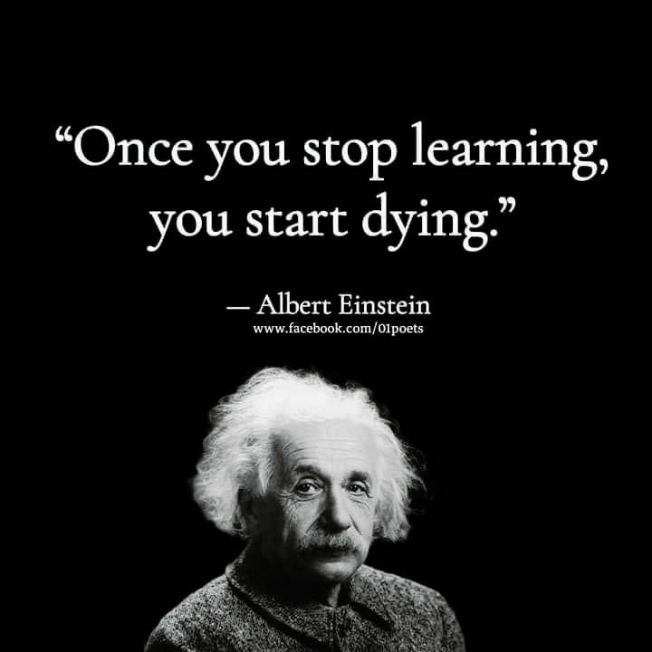

# Recommend Resource List

      
## _Professional Levels_ of this List  
★☆☆: Do just for Finish.  
★★☆: Do it Right.  
★★★: Do it Professionally.  

## Generic
  
| PM | Manager | Developer | Validation | Professional Level | Resources |    
| :---| :--- | :---- | :----| :-------| :--- | 
| ✔ | ✔ | △ | ✔ | ★☆☆ | __Object__: Write a good Specification. <ul><li>[ポケット図解 要求定義のポイントがわかる本](https://www.amazon.co.jp/-/en/%E4%BD%90%E5%B7%9D%E5%8D%9A%E6%A8%B9-ebook/dp/B00YE0GZ3S/)</li><li>[図解入門よくわかる最新要求定義実践のポイント](https://www.amazon.co.jp/-/en/%E6%9C%AC%E5%9C%92-%E6%98%8E%E5%8F%B2/dp/479801527X/)</li></ul>|
| -- | -- | ✔ | ✔ | ★☆☆ | __Object__: Write a good Design Note.<ul><li>[UMLは手段](https://www.amazon.co.jp/-/en/%E8%8D%92%E4%BA%95-%E7%8E%B2%E5%AD%90/dp/4774129372/)</li><li>[SEの文章術](https://www.amazon.co.jp/-/en/%E5%85%8B%E5%85%83-%E4%BA%AE/dp/4774141445/)</li></ul> |
|  |  | ✔ | ✔ | ★★☆ | Draw a professional circuit diagram. [fritzing](https://fritzing.org/) <ul><li>[How To Install fritzing on Ubuntu 20.04](https://installati.one/ubuntu/20.04/fritzing/)</li></ul> |
| ✔ | ✔ | ✔ | ✔ | ★★☆ | [深度職場力：拋開熱情迷思，專心把自己變強！](https://www.books.com.tw/products/0010788090)<ul><li>[關於熱情，我們都誤會大了：《深度職場力》閱讀心得](https://yen-chenhan.com/so-good-they-cant-ignore-you-2/)</li><li>[《深度職場力》——「把工作做好」比「入對行」更重要](https://www.iiispace.com/2020/08/10/000812/)</li></ul> |

  
## Project Management
  
| PM | Manager | Developer | Validation | Professional Level | Resources |    
| :---| :--- | :---- | :----| :-------| :--- | 
| ✔ | ✔ | ✔ | ✔ | ★★☆ | [Exploring Requirements: Quality Before Design](https://www.amazon.com/Exploring-Requirements-Quality-Before-Design/dp/0932633730) (Chinese version) [從需求到設計：如何設計出客戶想要的產品](https://www.books.com.tw/products/0010767312) |
| ✔ | ✔ |  | △ | ★★☆ | [PMBOK® Guide](https://www.pmi.org/pmbok-guide-standards/foundational/PMBOK) 6th edition or newer. The older edition of PMBOK mainly focus on waterfall approaches, __Agile__ is included since edition 6th. For people who has the older PMP certifications, here are useful references: [The Software Project Manager's Bridge to Agility](https://www.amazon.com/Software-Project-Managers-Bridge-Agility/dp/0321502752) (Chinese version) [軟體專案管理─軟體專案管理者邁向敏捷式橋樑](https://www.tenlong.com.tw/products/9789861816647) (Preview article) [Agile project management and the PMBOK® guide](https://www.pmi.org/learning/library/agile-project-management-pmbok-waterfall-7042) | 
| ✔ | ✔ | △ | △ | ★★☆ | <ul><li>[Mythical Man-Month, The: Essays on Software Engineering](https://www.amazon.com/Mythical-Man-Month-Software-Engineering-Anniversary/dp/0201835959) (Chinese version) [人月神話：軟體專案管理之道](https://www.books.com.tw/products/0010254508)</li><li>[Waltzing With Bears: Managing Risk on Software Projects](https://www.amazon.com/Waltzing-Bears-Managing-Software-Projects/dp/0932633609) (Chinese version) [與熊共舞：軟體專案的風險管理](https://www.books.com.tw/products/0010888540)</li><li>[Peopleware: Productive Projects and Teams](https://www.amazon.com/Peopleware-Productive-Projects-Teams-3rd/dp/0321934113/) (Chinese version) [Peopleware：腦力密集產業的人才管理之道](https://search.books.com.tw/redirect/move/key/peopleware/area/mid/item/0010872982/page/1/idx/1/cat/001/pdf/1/spell/3)</li></ul> | 
| ✔ | ✔ | △ | ✔ | ★★☆ | [Software Project Estimation: The Fundamentals for Providing High Quality Information to Decision Makers](https://www.amazon.com/Software-Project-Estimation-Fundamentals-Information/dp/1118954084) (Chinese version) [軟體專案估算](https://www.tenlong.com.tw/products/9786263332256)|  

## Software Engineering
  
| PM | Manager | Developer | Validation | Professional Level | Resources |    
| :---| :--- | :---- | :----| :-------| :--- | 
| △ | △ | ✔ | ✔ | ★★☆ | [Software Engineering at Google](https://www.amazon.com/Software-Engineering-Google-Lessons-Programming/dp/1492082791) \([pdf](https://raw.githubusercontent.com/wuzhouhui/misc/master/OReilly.Software.Engineering.at.Google.2020.3.pdf)\) (Chinese version) [Google 的軟體工程之道](https://www.tenlong.com.tw/products/9786263242630) |  

## Programming 
  
| PM | Manager | Developer | Validation | Professional Level | Resources |    
| :---| :--- | :---- | :----| :-------| :--- | 
|  |  | ✔ | ✔ | ★★☆ | [Ivor Horton 的程式語言教學手冊](https://www.tenlong.com.tw/search?utf8=%E2%9C%93&keyword=Ivor+Horton) Ivor Horton is a great guider for beginners, even very beginners, of Java and C++. His books for beginners are very complete on covering all aspects which are needed to be known. The following topics are __required__ to get very familiar with:<ul><li>Class, Extending Class and Inheritance.</li><li>Exceptions. </li><li>Threads.</li><li>Serializing Objects.</li><li>Generic Class Types.</li><li>The Collections Framework.</li></ul>__Note__: Nowadays, hash-map which has complexity O(1) is going to replace traditional map with O(logN). Get familiar with the newest hash-map concepts if your Java book doesn’t mention that. |
|  |  | ✔ | ✔ | ★☆☆ | [Writing Solid Code](https://www.amazon.com/Writing-Solid-Code-20th-Anniversary-dp-1570740550/dp/1570740550/) |
|  |  | ✔ | ✔ | ★★☆ | [Code Craft: The Practice of Writing Excellent Code](https://www.amazon.com/Code-Craft-Practice-Writing-Excellent-ebook/dp/B002MZAR6S/) (Chinese version) [編程創藝 - 編寫出卓越的程式碼](https://www.taaze.tw/usedList.html?oid=12100030572) |
|  |  | ✔ | ✔ | ★★★ | [Code Complete: A Practical Handbook of Software Construction](https://www.amazon.com/Code-Complete-Practical-Handbook-Construction/dp/0735619670) (Chinese version) [CODE COMPLETE：軟體開發實務指南](https://www.tenlong.com.tw/products/9789864341313) |
|  |  | ✔ | ✔ | ★★★ | [Clean Code: A Handbook of Agile Software Craftsmanship](https://www.amazon.com/Clean-Code-Handbook-Software-Craftsmanship/dp/0132350882) (Chinese version) [無瑕的程式碼－敏捷軟體開發技巧守則](https://www.tenlong.com.tw/products/9789862017050) |
|  |  | ✔ | ✔ | ★★★ | [Clean Agile: Back to Basics](https://www.amazon.com/Clean-Agile-Basics-Robert-Martin/dp/0135781868) (Chinese version) [無瑕的程式碼 敏捷篇：還原敏捷真實的面貌](https://www.tenlong.com.tw/products/9786263332584) |
|  |  | ✔ | ✔ | ★★★ | [Clean Architecture: A Craftsman's Guide to Software Structure and Design](https://www.amazon.com/Clean-Architecture-Craftsmans-Software-Structure/dp/0134494164) (Chinese version) [無瑕的程式碼－整潔的軟體設計與架構篇 + 實作篇 (雙書合購) ](https://www.tenlong.com.tw/products/PG-023?list_name=srh) |

## OS System
### Android
| PM | Manager | Developer | Validation | Professional Level | Resources |    
| :---| :--- | :---- | :----| :-------| :--- | 
|  |  | ✔ | ✔ | ★★☆ | [Efficient Android Threading: Asynchronous Processing Techniques for Android Applications](https://www.amazon.com/Efficient-Android-Threading-Asynchronous-Applications/dp/1449364136) (Chinese version) [Android 高效能多執行緒](https://www.tenlong.com.tw/products/9789863476016) |

## Programming Language
### Python
| PM | Manager | Developer | Validation | Professional Level | Resources |    
| :---| :--- | :---- | :----| :-------| :--- | 
|  |  | ✔ | ✔ | ★☆☆ | [Python Enhancement Proposals](https://peps.python.org/pep-0000/) |