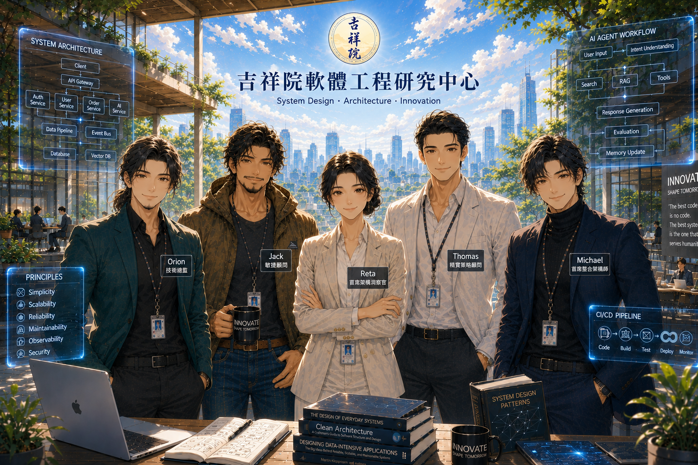

# 以四大關鍵思維看系統設計哲學

  

> [!note]  
> 本課程包含對金庸武俠小說部分人物與情節的評論、分析與案例研究，用以說明軟體工程與系統設計概念。所有相關著作權均屬原權利人所有。  

# 登場人物

| 人物 | 職稱 | 關鍵能力 | 見解風格 |   
| --- | --- | --- | --- |  
| Reta | [首席架構洞察官](../reference/CAIO.md) | 全局監察 | 洞察盲點 |   
| Orion | 技術總監 | 創新探索 | 技術最佳解 |   
| Jack | 敏捷顧問 | 實務導向 | 敏捷(Agile) |   
| Michael | 首席整合架構師 | 全局整合 | 全局最佳解 |  
| Thomas | 精實策略顧問 | 洞察本質 | 精實(Lean) |   

# 課程內容

## Season 01 系統設計  

| Video | Description | Date |
|:----|:----------|:--|
| <a href="" target="_blank"><image src="" width="200"></a> | [ Architecture Thinking、系統架構設計]() | |
| <a href="" target="_blank"><image src="" width="200"></a> | [架構審查（Architecture Review）]() | |
| <a href="" target="_blank"><image src="" width="200"></a> | [需求分析]() | |
| <a href="" target="_blank"><image src="" width="200"></a> | [打造 AI Agent]() | |
| <a href="" target="_blank"><image src="" width="200"></a> | [打造 Enterprise Architecture]() | |

## Season 02 管理哲學  

| Video | Description | Date |
|:----|:----------|:--|
| <a href="" target="_blank"><image src="" width="200"></a> | [專案管理哲學]() | |
| <a href="" target="_blank"><image src="" width="200"></a> | [系統重構]() | |
| <a href="" target="_blank"><image src="" width="200"></a> | [資安哲學]() | |
| <a href="" target="_blank"><image src="" width="200"></a> | [雲端架構]() | |
| <a href="" target="_blank"><image src="" width="200"></a> | [CTO 對談]() | |

    
## 番外篇  

| Video | Description | Date |
|:----|:----------|:--|
| <a href="" target="_blank"><image src="" width="200"></a> | [安倍晴明 × 服部半藏：五芒星系統架構之道]() | |
| <a href="" target="_blank"><image src="" width="200"></a> | [五行陣：Authority Matrix Framework 下的團隊成熟度演化模型]() | |
| <a href="" target="_blank"><image src="" width="200"></a> | [敏捷江湖：以四大關鍵思維看敏捷]() | |

## 實戰演練  

| Video | Description | Date |
|:----|:----------|:--|
| <a href="https://youtu.be/4RROHItZuWc" target="_blank"><image src="img/2026-07-25.png" width="200"></a> | [碧海潮生曲的系統架構 -- 從《射鵰英雄傳》看《易經》、五音、五行到狀態機](https://youtu.be/4RROHItZuWc) 

 大綱 
 ● 《射鵰英雄傳》中的《碧海潮生曲》 ● 第一層：陰陽（海潮） ● 第二層：五音（情緒） ● 第三層：內力（氣） ● 用系統架構重新理解《碧海潮生曲》 ● 九段《碧海潮生曲》 ● 《碧海潮定曲》：《碧海潮生曲》破解版 
 | 2026-07-25 |
| <a href="" target="_blank"><image src="" width="200"></a> | [從桃花陣到桃花海陣 -- 從《射鵰英雄傳》看系統破綻、破框創新與架構重塑]() | |
| <a href="" target="_blank"><image src="" width="200"></a> | 從奇門遁甲到決策工程學   ▶ [將古代謀略模型轉化為可驗證的 Adaptive Decision Framework]()  ▶ [從控制理論到自我進化決策架構]()  

架構圖
 [以王重陽與黃藥師的決策風格呈現的架構策略](./material/03-2_01.svg)   [以張三丰觀點做 Clean Architecture](./material/03-2_02.svg) 
 | |

   
---

# License｜授權條款

   
以四大關鍵思維看系統設計哲學 © 2026 作者 潘貞元（Reta Pan），採用  [姓名標示－非商業性－相同方式分享 4.0 國際版](https://creativecommons.org/licenses/by-nc-sa/4.0/legalcode.en) 授權。  

