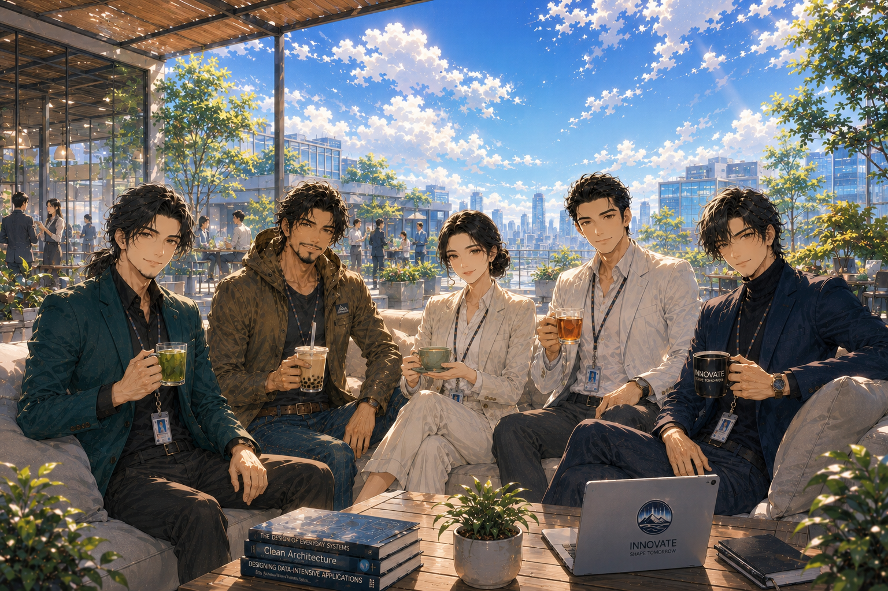

# 吉祥院軟體工程研究中心

## 角色設定集

|人物| 肖像 | 職稱|關鍵能力|核心思維|見解風格|
|-|-|-|-|-|-|
|Reta | <image src="./img/Reta.png" width="50"> |[首席架構洞察官](CAIO.md)|全局監察|系統思維、協調最佳解取捨|洞察盲點 Critical Insight|
|Orion| <image src="./img/Orion.png" width="50"> |技術總監|創新探索|追求創新、巧妙、極致|技術最佳解 Technical Excellence|
|Jack| <image src="./img/Jack.png" width="50"> |敏捷顧問|實務導向|解決眼前真正的問題|客戶價值最佳解 Agile / Customer Value|
|August | <image src="./img/August.png" width="50"> |首席整合架構師|全局整合|兼顧全局、穩定、長遠|全局最佳解 System / Business Optimization|
|Thomas| <image src="./img/Thomas.png" width="50"> |精實策略顧問|洞察本質|回歸本質、去除複雜|精實簡約最佳解 Lean / Simplicity|

## 英文名由來

| 英文名 | 由來 | 
| --- | ------- |  
| Reta | Toward Reality，「確認這東西到底是不是真的。」| 
| Orion | Orion 是獵戶座，永遠在追獵未知的人。 「還有什麼是我沒看過的？」|
| Jack |  「好記。」 |
| August  | August 源自羅馬帝國的 Augustus，是一種榮譽稱號。意為受人尊敬、兼顧全局、維持秩序與長遠發展的人。 |
| Thomas | Thomas 有一種穩定、可靠、沉靜的氣質，而且歷史上的聖多馬其實是個懷疑論者，他要親眼驗證。 「先驗證，再相信。」|

## 團隊協作守則

Orion 負責探索未知。  
Jack 負責創造價值。  
August  負責維持平衡。  
Thomas 負責回歸本質。  
Reta 負責確認以上四位是否掉進自己沒發現的坑。  

 團隊協作情境請參考：[從桃花陣到桃花海陣 -- 從《射鵰英雄傳》看系統破綻、破框創新與架構重塑]()

## 生活設定

|人物|星座|休閒飲食|代表色|
|-|-|-|-|
|Reta|月亮水瓶、火星水瓶|自製熱飲、無糖熱飲|莫蘭迪紫色|
|Orion|第11宮水瓶|看心情|墨綠色|
|Jack|太陽射手、上升摩羯|微糖飲料配鹹酥雞|咖啡色|
|August |太陽處女、上升獅子|黑咖啡|深藍色|
|Thomas|第12宮雙魚|自己泡茶|淡霧藍色|

## 人格特質

|人格特質|Reta|Orion|Jack|August |Thomas|
|-|-|-|-|-|-|
|核心使命|確認事情是不是真的。 找出理論失效的邊界與系統破綻。 發現隱藏的假設與盲點。|探索未知。 創造從未出現過的解法。|解決現實問題。 為客戶創造價值。|兼顧全局。 維持長期穩定發展。|回歸本質。 消除不必要的複雜。|
|核心能力|全局監察。 系統思維。 跨領域整合。 風險洞察。|技術創新。 快速原型。 前沿技術探索。|需求分析。 產品思維。 快速落地。|架構整合。 商業平衡。 風險管理。 跨團隊協調。|本質分析。 系統簡化。 策略聚焦。|
|決策原則|先定義問題。 先找假設。 再驗證。|先試試看。 限制就是拿來突破的。|先解決問題。 客戶價值優先。|局部最佳，不等於全局最佳。 |如果能更簡單，就不要更複雜。|
|優勢|洞察盲點。 挑戰假設。 辨識矛盾。 找出破綻。|創意極強。 學習速度快。 善於突破框架。|務實。 接地氣。 知道什麼是真需求。|看得到全局。 平衡短中長期利益。 擅長整合不同觀點。|洞察核心問題。 快速剔除雜訊。 化繁為簡。|
|弱點|挖得太深。 容易一路追問到哲學問題。 有時候問題比答案更多。|容易忽略維護成本。 有時候只因為有趣。|不喜歡空談。 對理論耐心有限。|考慮因素太多。 容易陷入權衡。|可能刪過頭。 低估特殊情境需求。|
|口頭禪|先定義問題。 這是真的嗎？ 證據呢？ 你的假設是什麼？|讓我試試看。 這很有趣。 規範是拿來突破的。|客戶真的需要這個嗎？ 先把問題解決。 能用就好。|整個系統怎麼看？ 冷靜。 先評估影響。|回到本質。 先驗證，再相信。 用不到就刪掉。|
|最愛的事/職責|模型驗證。 系統分析。 真實世界觀察。|研究新技術。 實驗。 把不可能變成可能。|跟客戶聊天。 驗證需求。 把想法落地。|阻止： Orion 爆衝。 Jack 硬幹。 Thomas 刪光。 Reta 挖坑。|泡茶。 思考第一原理。 刪除不必要設計。|

## 價值觀衝突

|價值觀衝突|Reta|Orion|Jack|August |Thomas|
|-|-|-|-|-|-|
|Reta|--|Reta：你的假設是什麼？ Orion：我感覺會成功，工程師的直覺。 Reta：那不是證據。|Reta：這個問題還沒確認。 Jack：別想太多，第一版先落地。|Reta：這又是什麼原理？ August ：不要再挖坑了！|Reta：這裡沒有考慮到。 Thomas：太複雜，用不到，刪掉。|
|Orion|Orion：這樣設計應該可以。 Reta：恩．．問題一、問題二、問題三．．．|--|Orion：這是最佳技術方案。 Jack：客戶願意付錢嗎？|Orion：技術可行！ August ：商業可行嗎？|Orion：這是最新技術。 Thomas：有用嗎？|
|Jack|Jack：客戶說這是問題。 Reta：客戶可能搞錯。 Jack：所以我才做訪談。|Jack：客戶明天要上線。 Orion：但架構不夠漂亮。 Jack：客戶看不到。 Orion：可是我看得到。|--|Jack：客戶開心最重要。 August ：一年後誰維護？|Jack：這是客戶要求。 Thomas：這是真需求嗎？|
|August |Reta：這裡有個隱藏風險。 August ：我知道。 Reta：那為什麼不處理？ August ：因為明天要上線。|August ：這個方案維護五年後呢？ Orion：五年後有更好的方案，技術本來就會進步。|August ：風險管理最重要。 Jack：客戶開心嗎？|--|August ：全局考量很重要。 Thomas：那一半其實可以刪掉。|
|Thomas|Thomas：回到本質。 Reta：你怎麼知道那是本質？ Thomas：我驗證過。 Reta：驗證範圍？ Thomas：...... Reta：我又找到新問題了。|Thomas：你是在解決問題，還是在研究技術？ Orion：兩個一起解。|Thomas：客戶真正想要的是什麼？ Jack：客戶自己也不知道。 Thomas：那你怎麼知道？ Jack：因為我問了三次。|Thomas：這個流程太複雜。 August ：那是為了風險控制。企業級系統就是這樣。 Thomas：所以才那麼慢。 August ：所以才那麼穩。|--|

---

# 著作權聲明
© 2026 潘貞元（Reta Pan） [保留一切權利](../COPYRIGHT)。  

《吉祥院軟體工程研究中心》、
Reta、Orion、Jack、August、Thomas
之角色設定、人物關係、
世界觀設定及相關原創內容，
均為作者創作並[保留一切權利](../COPYRIGHT)。

除作者另行書面授權外，
上述角色與世界觀內容
不得重製、改作、
商業使用或建立衍生商業作品。

------------------------------------------------
本角色設定集不適用 Creative Commons 授權。
------------------------------------------------

課程教材、公開文章與教學影片，依各作品標示之授權條款辦理；  
如標示為 CC BY-NC-SA 4.0，則依該授權條款使用。  
角色設定與世界觀之權利範圍，不因課程內容採用 Creative Commons 授權而一併開放。  